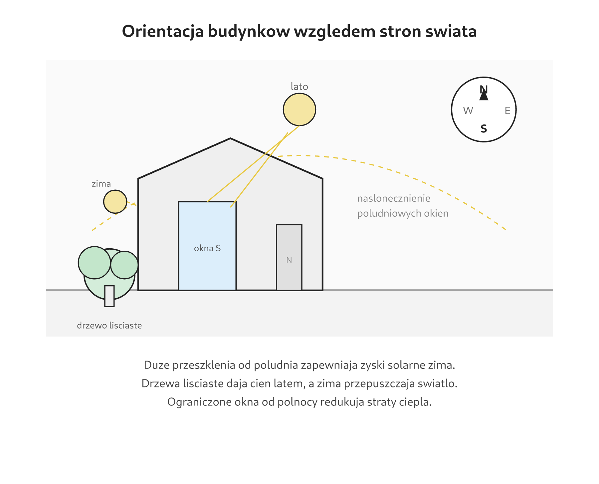
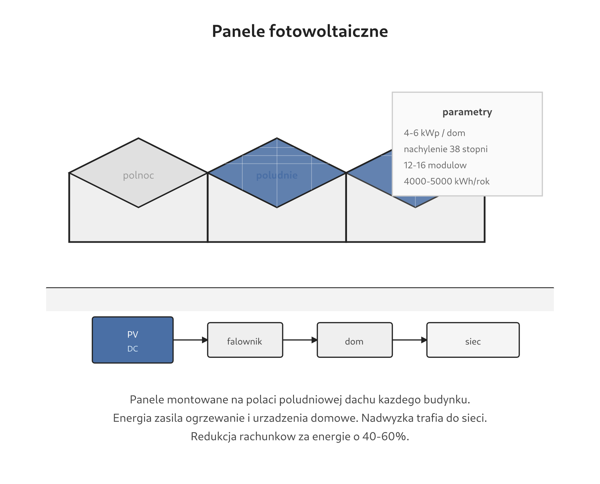
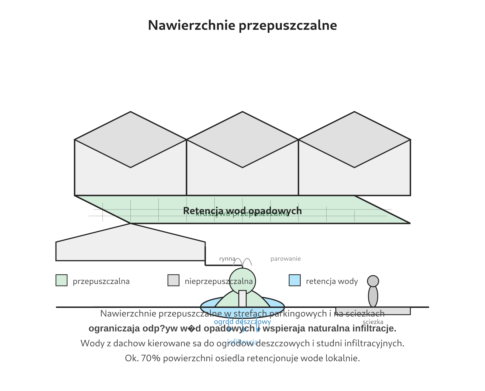
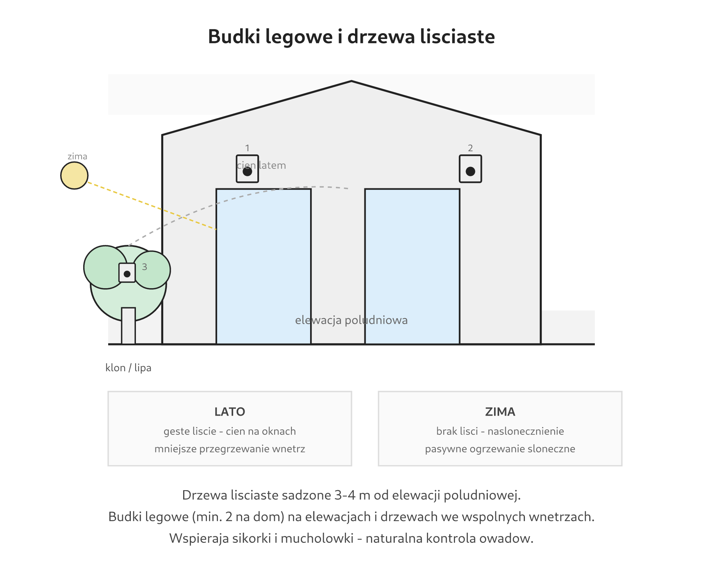
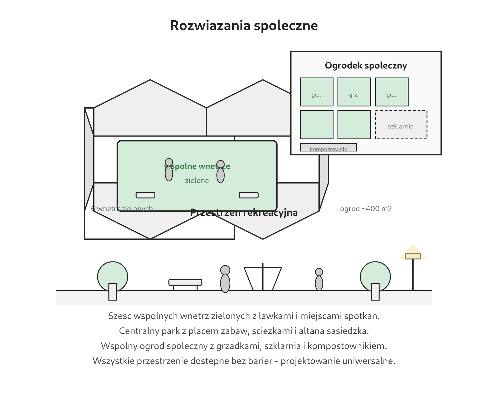

# Schematy projektowe — Park między domami

## Jak otworzyć schematy (najprościej)

### Opcja A — podwójne kliknięcie (POLECAM)
1. Pobierz folder `docs/schemes` z GitHub (lub cały repozytorium jako ZIP)
2. Otwórz plik **`podglad.html`** — dwukrotnie kliknij
3. Schematy otworzą się w przeglądarce (Chrome / Edge / Firefox)

### Opcja B — pliki PNG (do Worda / plansz)
Folder **`png/`** zawiera gotowe obrazy:
- `png/01-orientacja-pasywna.png`
- `png/02-fotowoltaika.png`
- `png/03-nawierzchnie-przepuszczalne.png`
- `png/04-biodiversnosc.png`
- `png/05-rozwiazania-spoleczne.png`

Wstaw je w Wordzie: **Wstaw → Obrazy → Ten komputer**

### Opcja C — GitHub
Na GitHubie kliknij plik `.png` w folderze `docs/schemes/png/` — obraz wyświetli się od razu.

---

## Spis schematów

| # | Schemat | PNG | SVG |
|---|---------|-----|-----|
| 1 | Orientacja pasywna | [png/01-orientacja-pasywna.png](png/01-orientacja-pasywna.png) | [01-orientacja-pasywna.svg](01-orientacja-pasywna.svg) |
| 2 | Panele fotowoltaiczne | [png/02-fotowoltaika.png](png/02-fotowoltaika.png) | [02-fotowoltaika.svg](02-fotowoltaika.svg) |
| 3 | Nawierzchnie przepuszczalne | [png/03-nawierzchnie-przepuszczalne.png](png/03-nawierzchnie-przepuszczalne.png) | [03-nawierzchnie-przepuszczalne.svg](03-nawierzchnie-przepuszczalne.svg) |
| 4 | Bioróżnorodność | [png/04-biodiversnosc.png](png/04-biodiversnosc.png) | [04-biodiversnosc.svg](04-biodiversnosc.svg) |
| 5 | Rozwiązania społeczne | [png/05-rozwiazania-spoleczne.png](png/05-rozwiazania-spoleczne.png) | [05-rozwiazania-spoleczne.svg](05-rozwiazania-spoleczne.svg) |

---

## 1. Orientacja budynków względem stron świata (rozwiązanie pasywne)

**Opis:** Domy szeregowe ustawione osią wschód–zachód, z głównymi oknami i ogrodami skierowanymi na południe. Duże przeszklenia od strony południowej zapewniają maksymalne zyski solarne zimą. Od strony północnej okna są ograniczone do minimum. Drzewa liściaste sadzone 3–4 m od elewacji południowej dają cień latem, a zimą przepuszczają światło słoneczne do wnętrz.

---

## 2. Panele fotowoltaiczne

**Opis:** Na każdym budynku instalacja fotowoltaiczna 4–6 kWp na połaci dachu skierowanej na południe. Szacunkowa produkcja: 4000–5000 kWh/rok na dom, co pokrywa 40–60% rocznego zapotrzebowania na energię.

---

## 3. Nawierzchnie przepuszczalne

**Opis:** Ścieżki piesze i place z kruszywa przepuszczalnego, parkingi z kostki ażurowej, ogrody deszczowe i studnie infiltracji. Ok. 70% powierzchni osiedla retencjonuje wodę opadową lokalnie.

---

## 4. Budki lęgowe i drzewa liściaste

**Opis:** Drzewa liściaste przy elewacjach południowych (klon, lipa, brzoza) oraz budki lęgowe na elewacjach i drzewach we wspólnych wnętrzach zielonych. Min. 2 budki na budynek.

---

## 5. Rozwiązania społeczne

**Opis:** Sześć wspólnych wnętrz zielonych, centralny park sąsiedzki oraz wspólny ogród społeczny (~400 m²) z grządkami, szklarnią i kompostownikiem. Wszystkie przestrzenie dostępne bez barier.
