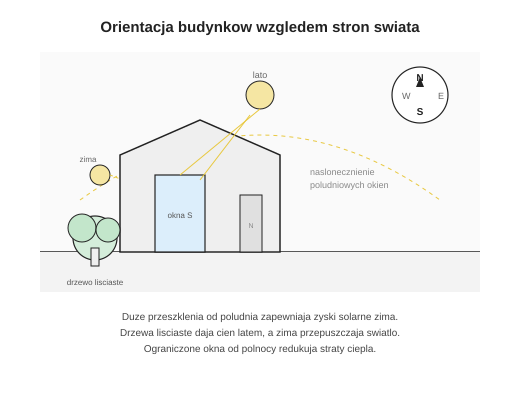
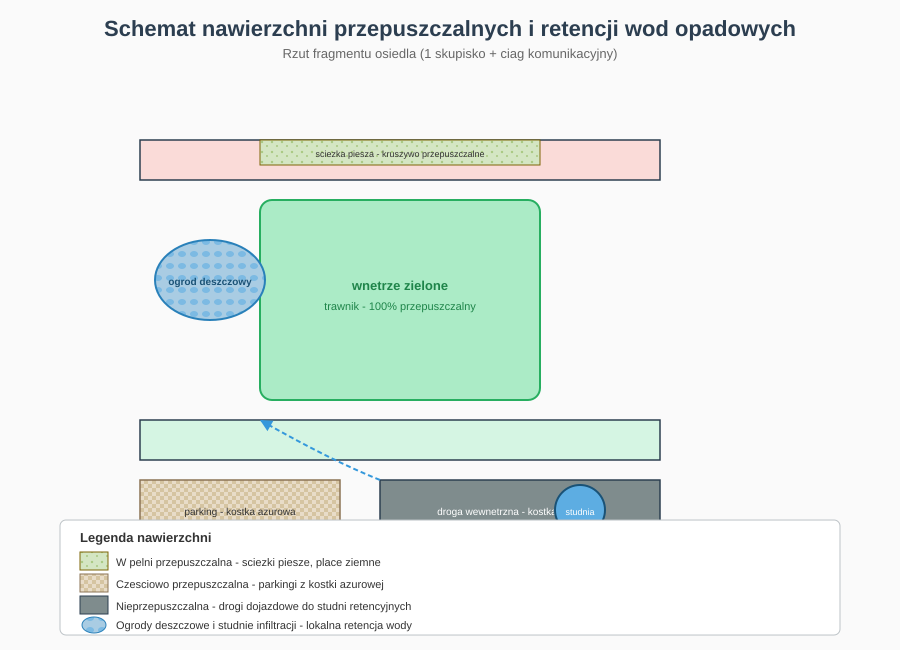
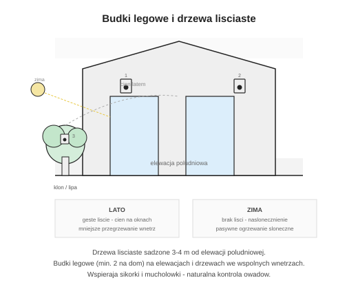

# Schematy projektowe — Park między domami

Zbiór schematów ilustrujących rozwiązania ekologiczne, pasywne i społeczne w projekcie osiedla.

---

## Spis schematów

| # | Schemat | Plik |
|---|---------|------|
| 1 | Orientacja pasywna | [01-orientacja-pasywna.svg](01-orientacja-pasywna.svg) |
| 2 | Panele fotowoltaiczne | [02-fotowoltaika.svg](02-fotowoltaika.svg) |
| 3 | Nawierzchnie przepuszczalne | [03-nawierzchnie-przepuszczalne.svg](03-nawierzchnie-przepuszczalne.svg) |
| 4 | Bioróżnorodność | [04-biodiversnosc.svg](04-biodiversnosc.svg) |
| 5 | Rozwiązania społeczne | [05-rozwiazania-spoleczne.svg](05-rozwiazania-spoleczne.svg) |

---

## 1. Orientacja budynków względem stron świata (rozwiązanie pasywne)

**Opis:** Domy szeregowe ustawione osią wschód–zachód, z głównymi oknami i ogrodami skierowanymi na południe. Duże przeszklenia od strony południowej zapewniają maksymalne zyski solarne zimą, gdy słońce jest nisko na niebie. Od strony północnej okna są ograniczone do minimum, co redukuje straty ciepła. Drzewa liściaste sadzone 3–4 m od elewacji południowej dają cień latem (ochrona przed przegrzewaniem), a zimą — po opadnięciu liści — przepuszczają światło słoneczne do wnętrz. Rozwiązanie to jest podstawą pasywnego ogrzewania budynku i nie wymaga dodatkowych urządzeń.

---

## 2. Panele fotowoltaiczne

**Opis:** Na każdym budynku przewidziano instalację fotowoltaiczną o mocy 4–6 kWp, montowaną na połaci dachu skierowanej na południe (nachylenie ~38°, zgodne z kątem dachu). Połaci północna pozostaje wolna od paneli. Energia elektryczna jest wykorzystywana na bieżąco do zasilania ogrzewania (pompa ciepła), wentylacji i urządzeń domowych. Nadwyżka produkcji trafia do sieci energetycznej. Szacunkowa roczna produkcja: 4000–5000 kWh na dom, co pokrywa 40–60% rocznego zapotrzebowania na energię.

---

## 3. Nawierzchnie przepuszczalne

**Opis:** Schemat pokazuje podział nawierzchni na terenie jednego skupiska osiedla. Ścieżki piesze i place w wewnętrznych dziedzińcach wykonane są z kruszywa przepuszczalnego lub trawy — woda opadowa wsiąka w grunt. Parkingi wyposażone w kostkę ażurową (infiltracja 50–80%). Jedynie drogi dojazdowe są nieprzepuszczalne; wody z nich spływają do ogrodów deszczowych i studni infiltracji zamiast do kanalizacji burzowej. Dzięki temu ok. 70% powierzchni osiedla retencjonuje wodę opadową lokalnie, co chroni przed podtopieniami i wspiera zieleń w okresach suszy.

---

## 4. Budki lęgowe i drzewa liściaste

**Opis:** Elementy wspierające bioróżnorodność na osiedlu. Drzewa liściaste (klon, lipa, brzoza) sadzone przy elewacjach południowych pełnią podwójną funkcję: klimatyczną (zacienienie latem, nasłonecznienie zimą) i ekologiczną (siedliska dla ptaków i owadów). Budki lęgowe montowane są na elewacjach południowych i wschodnich (min. 2 na budynek, wysokość 3–5 m) oraz na drzewach we wspólnych wnętrzach zielonych. Otwory dostosowane do gatunków: 32 mm (sikorki, muchołówki), 45 mm (dzierzby). Budki wykonane z naturalnego drewna liściastego, bez impregnacji chemicznej.

---

## 5. Rozwiązania społeczne

**Opis:** Schemat urbanistyczny całego osiedla z zaznaczonymi przestrzeniami społecznymi. Sześć wspólnych wnętrz zielonych (po jednym w każdym skupisku) wyposażonych w ławki i miejsca spotkań sąsiedzkich. Centralny park sąsiedzki łączy wszystkie skupiska i oferuje plac zabaw, ścieżki spacerowe, strefę grillowania oraz altanę sąsiedzką. Wspólny ogród społeczny (~400 m²) z grządkami dzierżawionymi przez mieszkańców, szklarnią i kompostownikiem — miejsce integracji międzypokoleniowej i edukacji ekologicznej. Wszystkie przestrzenie zaprojektowane zgodnie z zasadami projektowania uniwersalnego — dostępne bez barier dla osób w każdym wieku i o różnych możliwościach ruchowych.

---

## Jak użyć schematów

1. Otwórz pliki `.svg` w przeglądarce lub Illustratorze/Inkscape.
2. Eksportuj do PNG/JPG w rozdzielczości min. 300 dpi do wstawienia na plansze B2/A3.
3. Pod każdym schematem na planszy umieść skrócony opis z tego dokumentu (2–4 zdania).
4. Schematy można łączyć na jednej planszy „Rozwiązania ekologiczne i społeczne” (np. PL5 dodatkowe przekroje/schematy).
