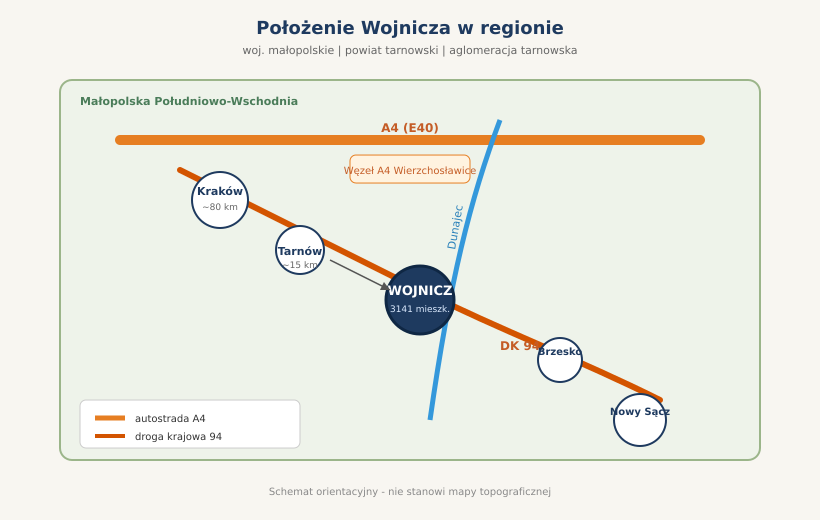
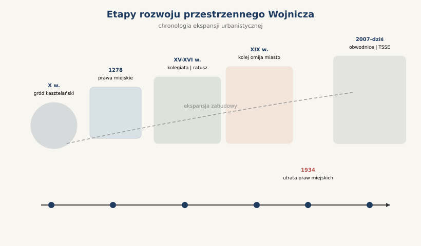
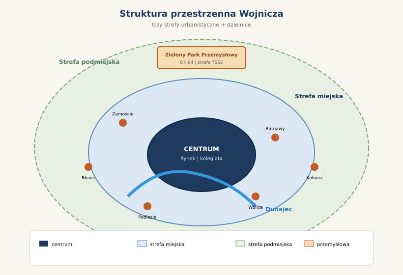
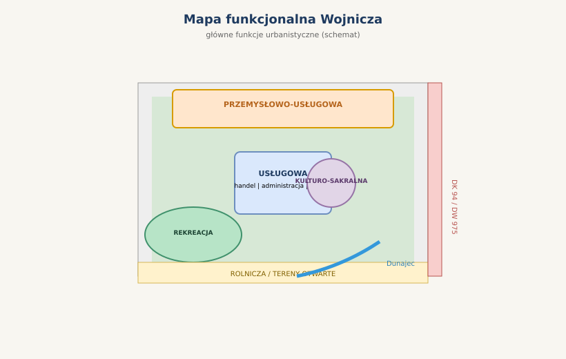

# Inventaryzacja miasta Wojnicz

**Praca grupowa — opis części opisowej**  
**Zakres: ok. 10–20 stron A4**  
**Język: polski**

---

## Spis treści

1. [Wstęp](#1-wstęp)
2. [Rys historyczny miasta](#2-rys-historyczny-miasta)
3. [Analiza rozwoju historycznego](#3-analiza-rozwoju-historycznego)
4. [Środowisko kulturowe](#4-środowisko-kulturowe)
5. [Układ zabudowy](#5-układ-zabudowy)
6. [Analiza przestrzenna](#6-analiza-przestrzenna)
7. [Analiza funkcjonalna](#7-analiza-funkcjonalna)
8. [Charakter miasta](#8-charakter-miasta)
9. [Układ komunikacyjny](#9-układ-komunikacyjny)
10. [Uwarunkowania przyrodnicze](#10-uwarunkowania-przyrodnicze)
11. [Demografia i struktura ludności](#11-demografia-i-struktura-ludności)
12. [Wywiad z mieszkańcami](#12-wywiad-z-mieszkańcami)
13. [Podsumowanie i wnioski](#13-podsumowanie-i-wnioski)

---

## 1. Wstęp

### Cel opracowania

Niniejsze opracowanie stanowi część opisową pracy z inventaryzacji miasta, realizowanej w ramach zajęć praktycznych na kierunku architektury. Celem dokumentu jest kompleksowa charakterystyka miasta Wojnicz — jednego z najstarszych ośrodków miejskich południowo-wschodniej Polski — w ujęciu wymaganym przez program przedmiotu dotyczący analizy rozwoju historycznego, rozpoznania elementów środowiska kulturowego i przyrodniczego oraz opisu współczesnej struktury urbanistycznej i funkcjonalnej.

### Zakres i metody badań

Praca obejmuje analizę deskryptywną i syntetyczną na podstawie:

- materiałów źródłowych i literatury historycznej dotyczącej Wojnicza;
- danych statystycznych GUS (stan na lata 2020–2022);
- obserwacji terenowych i analizy układu przestrzennego miasta;
- dokumentów planistycznych gminy Wojnicz;
- informacji o zabytkach wpisanych do rejestru zabytków województwa małopolskiego;
- przygotowanych pytań do wywiadu z mieszkańcami (do realizacji w terenie).

### Charakterystyka miasta Wojnicz

Wojnicz to miasto położone w województwie małopolskim, w powiecie tarnowskim, będące siedzibą gminy miejsko-wiejskiej Wojnicz. Wchodzi w skład aglomeracji tarnowskiej. Miasto liczy ok. **3141 mieszkańców** (2022 r.), zajmuje powierzchnię **8,5 km²**, a gęstość zaludnienia wynosi ok. **370 os./km²**. Wojnicz posiada status miasta od 1278 r. (z przerwą w latach 1934–2006), co czyni go wyjątkowym przykładem małego, lecz historycznie znaczącego ośrodka miejskiego Małopolski.

### Położenie administracyjne i regionalne

Wojnicz leży na **Podgórzu Bocheńskim**, w Kotlinie Sandomierskiej, na pograniczu Niziny Nadwiślańskiej i Pogórza Zachodniobeskidzkiego, u wylotu doliny Dunajca. Administracyjnie należy do powiatu tarnowskiego i województwa małopolskiego. Miasto pełni funkcję lokalnego ośrodka usługowego i administracyjnego dla otaczających wsi gminy (łączna liczba ludności gminy wynosi ok. **13 340 osób**). W kontekście regionalnym Wojnicz jest ważnym węzłem komunikacyjnym na szlaku Kraków – Tarnów – Nowy Sącz, w bezpośrednim sąsiedztwie autostrady A4 (węzeł Wierzchosławice) i drogi krajowej nr 94.

<figure>

<figcaption>Rys. 1. Położenie Wojnicza w regionie (schemat orientacyjny)</figcaption>
</figure>

---

## 2. Rys historyczny miasta

*(rozdział obowiązkowy)*

### Początki osadnictwa

Osadnictwo na terenie współczesnego Wojnicza rozwijało się już w epoce neolitu (4000–1700 p.n.e.), a następnie w okresach kultury łużyckiej i wczesnej epoki żelaza. Decydujące znaczenie dla powstania miasta miało **wczesnośredniowieczne grodzisko z X wieku**, wzniesione na suchej wyspie kilka metrów nad mokradłami doliny Dunajca. Gród pełnił funkcję **grodu kasztelańskiego** — jednego z elementów systemu fortyfikacyjnego strzegącego szlaku handlowego na Węgry. Legenda łączy powstanie osady z wojami drużyny Mieszka I lub Bolesława Chrobrego, od których miał pochodzić element „Woj-" w nazwie miejscowości.

### Kiedy powstał Wojnicz

Pierwsze pisemne wzmianki o Wojniczu pochodzą z **1217 r.** (forma *Woynicze*). W **1239 r.** odnotowano wizytę królewny węgierskiej Kingi, przyszłej żony Bolesława Wstydliwego — wówczas prawdopodobnie nadano miastu prawa miejskie. Pierwsza jednoznaczna wzmianka o Wojniczu jako mieście pochodzi z **25 listopada 1278 r.**, kiedy usypano wały miejskie. W **1349 r.** Kazimierz Wielki przeniósł miasto z prawa średzkiego na **prawo magdeburskie**, co przyspieszyło rozwój handlu i rzemiosła.

### Dlaczego powstało miasto

Lokalizacja Wojnicza nie była przypadkowa. Miasto powstało w strategicznym punkcie:

- na **szlaku handlowym Kraków – Węgry**, wzdłuż Wisły, Dunajca i dalszych dopływów;
- w miejscu **przeprawy przez Dunajec** (mosty budowano m.in. w 1521 i 1527 r.);
- jako **centrum kasztelania wojnickiej** — jednej z najstarszych jednostek administracyjnych Małopolski;
- w pobliżu **komory celnej** i miejsca targowego (prawo składu).

Wojnicz pełnił więc funkcję grodu obronnego, ośrodka administracyjnego, handlowego i celnego — typową dla średniowiecznych miast lokacyjnych południowej Polski.

### Rozwój w średniowieczu

XIV–XV wiek to okres świetności Wojnicza. W **1381 r.** miasto stało się siedzibą powiatu. W **1465 r.** wzniesiono gotycką kolegiatę św. Wawrzyńca, utworzono kolegium kapłanów i szkołę kolegiacką. W **1456 r.** Kazimierz Jagiellończyk zezwolił na cotygodniowe targi. Rozwijały się cechy rzemieślnicze (m.in. szewców od 1496 r.), handel i edukacja. W **1575 r.** potwierdzono istnienie murowanego ratusza z wieżą, dzwonem i zegarem na rynku.

### Okres zaborów

Po I rozbiorze (1772 r.) Wojnicz znalazł się pod panowaniem austriackim. W **1800 r.** ponownie stał się siedzibą powiatu w cyrkule bocheńskim. Rozwój miasta hamowały pożary (m.in. 1745, 1831, 1895 r.) oraz stopniowy spadek znaczenia administracyjnego — w **1867 r.** zlikwidowano powiat wojnicki. W **1856 r.** wybudowano linię kolejową Galicyjskiej Kolei Transwersalnej im. Karola Ludwika, która **omijała centrum miasta**, co ograniczyło jego dalszy dynamiczny rozwój przemysłowy.

### Rozwój w XIX–XX wieku

XIX wiek przyniósł modernizację infrastruktury: powstał sąd powiatowy (1851 r.), rozwijał się drobny przemysł i handel bydłem. W **1934 r.** Wojnicz utracił prawa miejskie — formalnie stał się wsią, co odzwierciedlało jego regres gospodarczy i administracyjny. II wojna światowa przyniosła okupację niemiecką, masowe represje, zagładę społeczności żydowskiej oraz obóz pracy przymusowej (1944 r.). W **1945 r.** miasto zostało wyzwolone przez Armię Czerwoną.

Okres powojenny to odbudowa, rozwój oświaty rolniczej i stopniowa modernizacja. Symbolem odrodzenia miejskości stało się **odzyskanie praw miejskich 1 stycznia 2007 r.** — po 72 latach.

### Współczesne przemiany miasta

Po 2007 r. Wojnicz dynamicznie rozwija infrastrukturę drogową: w **2007 r.** otwarto obwodnicę w ciągu DK 94, a w **2014 r.** wschodnią obwodnicę w ciągu DW 975. Powstał **Zielony Park Przemysłowy** (2006 r.) z podstrefą Tarnowskiej Specjalnej Strefy Ekonomicznej. W **2014 r.** kościół św. Wawrzyńca ponownie otrzymał status kolegiaty. Miasto coraz silniej wiąże swój rozwój z aglomeracją tarnowską i europejskimi korytarzami transportowymi (A4, E40).

### Najważniejsze wydarzenia historyczne

| Rok | Wydarzenie |
|-----|-----------|
| X w. | Powstanie grodu kasztelańskiego |
| 1109 | Fundacja kościoła św. Wawrzyńca |
| 1278 | Pierwsza wzmianka o Wojniczu jako mieście |
| 1465 | Utworzenie kolegiaty i szkoły kolegiackiej |
| 1655 | Bitwa pod Wojniczem (wojna polsko-szwedzka) |
| 1772 | Zabór austriacki |
| 1856 | Budowa linii kolejowej omijającej miasto |
| 1934 | Utrata praw miejskich |
| 1939 | Wejście wojsk niemieckich |
| 2007 | Odzyskanie praw miejskich |
| 2014 | Otwarcie wschodniej obwodnicy DW 975 |

---

## 3. Analiza rozwoju historycznego

*(analiza rozwoju historycznego miasta)*

### Etapy rozwoju przestrzennego

Rozwój Wojnicza można podzielić na następujące fazy:

1. **Faza grodu (X–XIII w.)** — zagęszczenie zabudowy w obrębie wałów grodziskowych na wyspie w dolinie Dunajca.
2. **Faza lok to średniowieczna (XIV–XVI w.)** — lokacja miasta na prawie magdeburskim, wykształcenie rynku i układu ulic promienistych i szachulca.
3. **Faza wczesnow nowożytna (XVII–XVIII w.)** — odbudowy po wojnach i pożarach, rozbudowa zabudowy sakralnej i rezydencjonalnej (dwór starostów).
4. **Faza zaborowa i industrializacji (XIX w.)** — peryferyjne położenie względem kolei, powolny wzrost, zachowanie historycznego układu urbanistycznego.
5. **Faza regresu i odbudowy (XX w.)** — utrata praw miejskich, zniszczenia wojenne, odbudowa i ponowne uzyskanie statusu miasta.
6. **Faza współczesna (od 2007 r.)** — rozwój stref przemysłowych, obwodnic, integracja z aglomeracją tarnowską.

### Rozszerzanie granic miasta

Historyczne miasto koncentrowało się w obrębie wałów średniowiecznych i rynku. W miarę rozwoju powstawały przedmieścia: **Zamoście** (siedziba starostów), **Ratnawy**, **Błonie**, **Kolonia**, **Podlesie**, **Wolice**. W XX w. miasto rozszerzyło się w kierunku północnym wzdłuż DK 94, gdzie wykształciła się strefa przemysłowo-usługowa (Zielony Park Przemysłowy). Współczesne granice administracyjne obejmują zarówno zwarte centrum historyczne, jak i luźniejszą zabudowę podmiejską.

### Zachowane historyczne struktury urbanistyczne

Do dziś zachował się **historyczny układ urbanistyczny** wpisany do rejestru zabytków województwa małopolskiego. Należą do nich:

- średniowieczny **rynek** z zachowanym układem placu;
- sieć ulic historycznych (m.in. Jagiellońska, Krakowska, Tarnowska);
- **Wały Kasztelańskie** — relikty fortyfikacji z XV w.;
- zespół kolegiaty z dzwonnica drewnianą (1533 r.);
- kościół św. Leonarda;
- dwór Dąmbskich z parkiem;
- tradycyjna zabudowa mieszkaniowa i kamienice.

Układ ten przetrwał w zasadzie w niezmienionej formie od średniowiecza — co jest rzadkością w skali regionu.

### Wpływ historii na współczesny układ miasta

Historia Wojnicza wyraźnie kształtuje jego współczesną strukturę:

- **Centrum funkcjonalne** nadal koncentruje się wokół rynku i kolegiaty — tu mieszczą się urząd miasta, instytucje kultury, handel detaliczny.
- **Ominięcie przez kolej (1856 r.)** spowodowało, że miasto nie stało się wielkim ośrodkiem przemysłowym — zachowało skalę małego miasteczka.
- **Utrata praw miejskich (1934 r.)** spowolniła inwestycje, ale jednocześnie uchroniła zabytkowy układ przed wielkimi ingerencjami modernistycznymi.
- **Obwodnice (2007, 2014 r.)** odciążyły centrum od ruchu tranzytowego, poprawiając jakość przestrzeni publicznej w historycznym rdzeniu.

<figure>

<figcaption>Rys. 2. Etapy rozwoju przestrzennego Wojnicza (schemat chronologiczny)</figcaption>
</figure>

---

## 4. Środowisko kulturowe

*(rozeznanie elementów środowiska kulturowego)*

### Zabytki architektury

Najważniejsze obiekty architektoniczne Wojnicza:

- **Kolegiata pw. św. Wawrzyńca** — gotyckie prezbiterium z XV w., nawa odbudowana w XVIII w., wnętrze z rokokową polichromią J. Neyderfera (1767 r.);
- **Drewniana dzwonnica** przy kolegiacie — datowana na **1533 r.**, unikatowy zabytek późnośredniowiecznego budownictwa drewnianego;
- **Kościół pw. św. Leonarda** — drewniana świątynia cmentarna z XVIII w.;
- **Dwór Dąmbskich** z parkiem — rezydencja starostów wojnickich, II poł. XIX w.;
- **Kamienica przy ul. Jagiellońskiej 1 / Rynek 9** — przykład historycznej zabudowy rynkowej;
- **Kaplica Matki Boskiej Loretańskiej** (1905 r.) — obiekt szlaku kaplic loretańskich;
- **Grodzisko** — relikty wczesnośredniowiecznego grodu na terenie miasta.

### Obiekty sakralne

Wojnicz od XI w. jest związany z kultem **św. Wawrzyńca** — patrona miasta, obecnego w herbie gminy. Kolegiata pełniła przez wieki rolę centrum duszpasterskiego rozległego archidiakonatu wojnickiego (od 1751 r.). Kościół św. Leonarda pełnił funkcję szpitalną — przy nim działał szpital ubogich od XIV w. Dzień patrona miasta przypada **10 sierpnia**.

### Historyczny układ rynku

Rynek w Wojniczu zachował średniowieczny charakter. W centralnej części stoi **pomnik św. Floriana** (1843 r.) upamiętniający pożar z 1831 r. oraz **Pomnik Niepodległości** (1934 r.). Na rynku nie odbudowano ratusza po pożarze z 1831 r. — dziś jego miejsce upamiętnia tablica. Przy rynku zachowały się kamienice, budynek dawnej szkoły oraz Findrówka — galeria i przestrzeń wystawiennicza.

### Dziedzictwo kulturowe

Wojnicz posiada bogate dziedzictwo niematerialne:

- legendy o grodzie wojów i osadzie Trojnik;
- tradycja cechów rzemieślniczych (szewcy, cech wielki od 1530 r.);
- **Laudum Wojnickie** (1503 r.) — akt prawa ziemskiego ziemi krakowskiej;
- pamięć o bitwie pod Wojniczem (1655 r.);
- tradycja szkolnictwa sięgająca XIV w. (szkoła kolegiacka, Lyceum Woynicianum);
- działalność **Towarzystwa Przyjaciół Ziemi Wojnickiej** i kwartalnika „Zeszyty Wojnickie” (od 1992 r.).

### Tradycje lokalne

Do tradycji lokalnych należą:

- obchody święta patrona miasta (św. Wawrzyńca);
- imprezy kulturalne organizowane przez Gminny Ośrodek Kultury;
- działalność Izby Regionalnej im. ks. Jana Królikiewicza;
- fotoklub Wojnicz i koło pszczelarzy;
- pielęgnowanie pamięci o lotnikach alianckich (Pomnik w Dębinie Zakrzowskiej, 1991 r.).

### Instytucje kultury

- Gminny Ośrodek Kultury
- Gminna Biblioteka Publiczna
- Kino Wawel
- Galeria Findrówka
- Izba Regionalna im. ks. Jana Królikiewicza
- Towarzystwo Przyjaciół Ziemi Wojnickiej

---

## 5. Układ zabudowy

*(rozdział obowiązkowy)*

### Historyczna zabudowa centrum

Centrum Wojnicza tworzy zwarta, niska zabudowa wokół rynku. Dominują **kamienice i domy murowane** o 1–3 kondygnacjach, z tradycyjnymi dachami dwuspadowymi. Na rynku i ulicach adjacentnych (Jagiellońska, Krakowska) zachowały się obiekty o charakterze zabytkowym. Zabudowa centrum ma charakter **ciągły**, tworząc wyraźne fronty uliczne i zamykając przestrzeń rynku.

### Zabudowa jednorodzinna

Na obrzeżach miasta i w dzielnicach (**Ratnawy, Zamoście, Błonie, Kolonia, Podlesie, Wolice**) dominuje **zabudowa jednorodzinna** — domy wolnostojące i bliźniacze, często z ogrodami. W rejonie Podlesia i Wolice występują również **domy drewniane** z XIX w., stanowiące cenny element lokalnego krajobrazu.

### Zabudowa wielorodzinna

Zabudowa wielorodzinna w Wojniczu ma ograniczony zasięg. Pojedyncze bloki i budynki wielorodzinne zlokalizowano głównie w rejonie ulic Szkolnej, Jagiellońskiej i osiedli powojennych. Nie dominują one w krajobrazie urbanistycznym miasta.

### Zabudowa usługowa

Funkcje usługowe koncentrują się:

- w **centrum** — handel detaliczny, gastronomia, usługi finansowe, apteki;
- wzdłuż **ul. Jagiellońskiej i Tarnowskiej** — usługi codzienne, warsztaty, punkty medyczne;
- w rejonie **DK 94** — stacje paliw, hotele, punkty motoryzacyjne.

### Zabudowa przemysłowa

Strefa przemysłowa skoncentrowana jest w **północno-zachodniej części miasta** — Zielony Park Przemysłowy z podstrefą TSSE. Zlokalizowano tu zakłady produkcyjne i magazynowe, wykorzystujące dogodny dostęp do A4 i DK 94. W przeszłości działały tu również m.in. browar (do I wojny światowej) i drobne warsztaty rzemieślnicze.

### Intensywność zabudowy

Intensywność zabudowy jest **najwyższa w centrum** (rynek i okolice), **umiarkowana** w strefie miejskiej (ulice historyczne) i **niska** w strefie podmiejskiej. Miasto charakteryzuje się niską gęstością zabudowy w porównaniu z Tarnowem czy Bochnią.

### Wysokość zabudowy

Dominuje zabudowa **niskowa i średnia** — 1–3 kondygnacje. Wieża kolegiaty i dzwonnica stanowią dominanty wysokościowe centrum. W strefie przemysłowej występują hale jednokondygnacyjne. Brak wysokiej zabudowy biurowej lub wielkopowierzchniowej.

---

## 6. Analiza przestrzenna

*(rozdział obowiązkowy)*

### Struktura przestrzenna miasta

W układzie przestrzennym Wojnicza wyróżnia się **trzy strefy**:

1. **Centrum** — zwarta zabudowa wokół rynku, kolegiaty i urzędu miasta; główna strefa usług, kultury i turystyki.
2. **Strefa miejska** — historyczny układ ulic, zabytkowa zabudowa, Wały Kasztelańskie, zespół dworu z parkiem; mieszanka funkcji mieszkaniowych i usługowych.
3. **Strefa podmiejska** — luźniejsza zabudowa jednorodzinna, tereny zieleni, w tym północna strefa przemysłowo-usługowa wzdłuż DK 94.

Integralną część miasta stanowią dzielnice: Ratnawy, Zamoście, Błonie, Kolonia, Podlesie i Wolice.

<figure>

<figcaption>Rys. 3. Struktura przestrzenna miasta — trzy strefy i dzielnice (schemat)</figcaption>
</figure>

### Dominanty przestrzenne

Najważniejsze dominanty:

- **Kolegiata św. Wawrzyńca z dzwonnicą** — centralna dominanty historyczna;
- **Kościół św. Leonarda** — dominanty południowo-wschodnia;
- **Wały Kasztelańskie** — dominanta krajobrazowa i historyczna;
- **Dwór Dąmbskich z parkiem** — dominanty zieleni i architektury rezydencjonalnej;
- **Most na Dunajcu** — dominanty infrastrukturalna i wizualna od strony rzeki.

### Osie kompozycyjne

Główne osie urbanistyczne:

- **oś rynkowa** — ciąg Rynek – ul. Jagiellońska;
- **oś północ–południe** — ul. Krakowska – Rynek – ul. Tarnowska (kierunek Tarnów / Nowy Sącz);
- **oś wschód–zachód** — ciąg wiążący Zamoście z centrum;
- **oś Dunajca** — naturalna granica i korytarz krajobrazowy od południa.

### Węzły i punkty charakterystyczne

- **Rynek** — główny węzeł społeczno-spacerowy;
- **Plac targowy / urząd miasta** — węzeł administracyjny;
- **Węzeł DK 94 / DW 975** — węzeł komunikacyjny północny;
- **Przystanek kolejowy Wojnicz** — węzeł transportu zbiorowego (poza ścisłym centrum);
- **Zielony Park Przemysłowy** — węzeł gospodarczy.

### Granice funkcjonalne

Granice między strefami nie są ostre, lecz czytelne:

- centrum – strefa miejska: przejście od zwartej zabudowy do luźniejszej na obrzeżach rynku;
- strefa miejska – podmiejska: wyznaczona głównie przez zmianę gęstości i typ zabudowy;
- strefa przemysłowa: wyraźnie odseparowana od centrum, wzdłuż DK 94.

### Tereny rozwojowe

Potencjalne tereny rozwoju:

- obszary wokół **Zielonego Parku Przemysłowego** — dalsza rozbudowa strefy ekonomicznej;
- tereny po dawnym browarze i obiektach przemysłowych w Zamościu;
- pofabryczne i rolne tereny na peryferiach Podlesia i Wolice;
- obszary przy wschodniej obwodnicy — usługi związane z ruchem tranzytowym.

---

## 7. Analiza funkcjonalna

*(rozdział obowiązkowy)*

### Funkcja mieszkaniowa

Funkcja mieszkaniowa jest **dominująca** — zarówno w centrum (zabytkowe kamienice), jak i na peryferiach (domy jednorodzinne). Brak dużych wielkoskalowych inwestycji mieszkaniowych sprawia, że miasto zachowało kameralny charakter.

### Funkcja usługowa

Usługi skoncentrowane są w centrum i wzdłuż głównych ulic. Obejmują handel, gastronomię, usługi finansowe, fryzjerstwo, naprawy. **Wojnickie Centrum Medyczne** i punkt lekarski zapewniają podstawową opiekę zdrowotną. Poziom usług odpowiada potrzebom małego miasta, choć część mieszkańców korzysta z oferty Tarnowa (ok. 15 km).

### Funkcja handlowa

Handel detaliczny działa głównie w centrum i przy DK 94. Rynek i okoliczne ulice pełnią funkcję lokalnego centrum handlowego. Brak dużych centrów handlowych — za zakupy wielkopowierzchniowe mieszkańcy często jeżdżą do Tarnowa lub Brzeska.

### Funkcja administracyjna

Wojnicz jest **siedzibą gminy miejsko-wiejskiej** — urząd miejski przy Rynku 1, komisariat policji, sąd rejonowy (historia sądownictwa od 1851 r.). Miasto pełni funkcję centrum administracyjnego dla ok. 13 340 mieszkańców gminy.

### Funkcja przemysłowa

Funkcja przemysłowa koncentruje się w **Zielonym Parku Przemysłowym** — strefie ekonomicznej z ulgami podatkowymi i dostępem do A4. Jest to istotny kierunek rozwoju gospodarczego miasta w XXI w.

### Funkcja rekreacyjna

Tereny rekreacyjne obejmują:

- park dworski Dąmbskich;
- tereny nad Dunajcem;
- boiska i halę sportową przy Zespole Szkół Licealnych i Technicznych;
- rezerwat przyrody Panieńska Góra (w granicach gminy);
- szlaki piesze wokół Wałów Kasztelańskich.

Oferta rekreacyjna jest skromna, lecz uzupełniana przez tereny wiejskie otaczającej gminy.

### Funkcja rolnicza

Na terenach peryferyjnych i w części gminy wiejskiej utrzymuje się **funkcja rolnicza** — pola uprawne, łąki i sady. Po II wojnie światowej rozwijało się tu także wykształcenie rolnicze. W samym mieście rolnictwo ma charakter residualny.

<figure>

<figcaption>Rys. 4. Mapa funkcjonalna Wojnicza (schemat podziału funkcji)</figcaption>
</figure>

---

## 8. Charakter miasta

*(rozdział obowiązkowy: „Jakie miasto?")*

### Miasto mieszkaniowe

Wojnicz jest przede wszystkim **miastem mieszkaniowym** — dominuje zabudowa jedno- i wielorodzinna, a ludność miasta i gminy pracuje głównie poza rolnictwem (w Tarnowie, strefie ekonomicznej, lokalnych zakładach).

### Miasto usługowe

Pełni funkcję **lokalnego ośrodka usługowego** dla wsi gminy — handel, edukacja (szkoły podstawowa, liceum, technikum), kultura, administracja.

### Miasto historyczne

Wojnicz jest **miastem historycznym** o wyjątkowo zachowanym średniowiecznym układzie urbanistycznym. Zabytki sakralne, Wały Kasztelańskie i tradycja kolegiaty nadają mu silny **charakter dziedzictwa kulturowego**.

### Miasto turystyczne

Potencjał turystyczny opiera się na:

- zabytkach sakralnych (kolegiata, dzwonnica, kościół św. Leonarda);
- Wałach Kasztelańskich;
- szlaku kaplic loretańskich;
- bliskości Dunajca i Pogórza;
- imprezach kulturalnych (Findrówka, Izba Regionalna).

Turystyka ma charakter **uzupełniający** — nie jest główną funkcją miasta, lecz stanowi szansę rozwoju.

### Funkcje ponadlokalne

- **węzeł komunikacyjny** DK 94 / DW 975 / A4;
- **strefa ekonomiczna** (TSSE);
- **ośrodek edukacyjny** (ZSLiT im. Jana Pawła II);
- historyczne znaczenie sakralne (kolegiata, dekanat).

### Znaczenie w regionie

Wojnicz pełni rolę **średniej wielkości ośrodka subregionalnego** — mniejszego od Tarnowa i Bochni, lecz większego od sąsiednich miejscowości wiejskich. Jego znaczenie rośnie dzięki obwodnicom i strefie ekonomicznej, które integrują miasto z europejskim korytarzem transportowym.

**Podsumowanie charakteru:** Wojnicz to **małe, historyczne miasto mieszkaniowo-usługowe** z rosnącymi funkcjami przemysłowymi i komunikacyjnymi, o silnym dziedzictwie sakralnym i potencjale turystycznym.

---

## 9. Układ komunikacyjny

*(rozdział obowiązkowy)*

### Sieć drogowa

Podstawę układu komunikacyjnego stanowią:

- **Droga krajowa nr 94** (E40) — główny ciąg tranzytowy Kraków – Tarnów – Rzeszów, przebiegający przez miasto; historyczna „stara czwórka", alternatywa dla A4;
- **Droga wojewódzka nr 975** — łączy Wojnicz z węzłem A4 w Wierzchosławicach;
- **Droga wojewódzka nr 973** — ciąg Brzesko – Wojnicz;
- sieć dróg gminnych i lokalnych łączących dzielnice i wsie.

### Drogi wojewódzkie i krajowe

**DK 94** jest najważniejszą arterią — przed budową obwodnic prowadziła ruch tranzytowy przez centrum miasta. **DW 975** pełni funkcję obwodnicy wschodniej i łączy południe regionu z autostradą A4.

### Obwodnica miasta

Wojnicz posiada **dwie obwodnice**:

1. **Obwodnica północna (2007 r.)** — w ciągu DK 94, długości ok. 2,3 km; odciąża centrum od ruchu w kierunku Krakowa i Tarnowa.
2. **Obwodnica wschodnia (2014 r.)** — w ciągu DW 975, łączna długość ok. 7 km (w tym most na Więckówce); łączy południe Małopolski z węzłem A4, omijając centrum i Tarnów.

Obwodnice znacząco poprawiły jakość życia w centrum i zwiększyły atrakcyjność inwestycyjną miasta.

### Powiązania z powiatem tarnowskim

Wojnicz jest połączony z Tarnowem (ok. 15 km) drogą DK 94. Stanowi **zachodnie obejście Tarnowa** dla ruchu jadącego z południa w kierunku A4. W powiecie tarnowskim pełni funkcję drugiego co do wielkości ośrodka miejskiego (po Tarnowie).

### Połączenia z Tarnowem

- **droga** — DK 94 (ok. 15 min samochodem);
- **kolej** — stacja Wojnicz na linii 103 Tarnów – Krynica (Koleje Małopolskie / Polregio);
- **autobus** — regularne połączenia komunikacji lokalnej i regionalnej.

Wielu mieszkańców Wojnicza **dojazd do pracy w Tarnowie** — miasto pełni więc funkcję „miasta sypialnego" aglomeracji tarnowskiej.

### Komunikacja autobusowa

Komunikacja autobusowa obsługuje połączenia wewnątrz gminy oraz do Tarnowa, Brzeska, Nowego Sącza i Bochni. Przystanki zlokalizowane są w centrum, przy DK 94 i w dzielnicach.

### Transport kolejowy

Linia kolejowa nr **103** (Tarnów – Stroze – Gorlice – Krynica) biegnie przez Wojnicz, lecz **stacja leży poza centrum** miasta — co jest konsekwencją historycznej decyzji o budowie trasy w 1856 r. z pominięciem miasta. Transport kolejowy ma znaczenie regionalne, lecz ograniczone w skali lokalnej.

### Infrastruktura rowerowa

Infrastruktura rowerowa jest **niewystarczająca** — brak wydzielonych ścieżek rowerowych w centrum. Potencjał istnieje wzdłuż Dunajca i na terenach gminnych, lecz wymaga inwestycji.

### Dostępność komunikacyjna

Dostępność komunikacyjna Wojnicza oceniana jest **dobrze** w skali regionalnej (A4, DK 94, obwodnice) i **umiarkowanie** w skali lokalnej (ograniczenia transportu publicznego, brak infrastruktury rowerowej, stacja kolejowa poza centrum).

<figure>

<figcaption>Rys. 5. Układ komunikacyjny — drogi, obwodnice, kolej i powiązania regionalne (schemat)</figcaption>
</figure>

---

## 10. Uwarunkowania przyrodnicze

*(rozdział obowiązkowy)*

### Położenie geograficzne

Wojnicz leży na **Podgórzu Bocheńskim**, w Kotlinie Sandomierskiej, na obszarze **zapadliska przedkarpackiego**, u wylotu doliny Dunajca na Nizinę Nadwięlańską. Od południa miasto sąsiaduje z **Pogórzem Wiśnickim** (Karpaty fliszowe). Współrzędne: ok. 49°57′N, 20°50′E.

### Rzeźba terenu

Teren miasta jest **płaskowyżowy z lekkim nachyleniem** w kierunku północnym. Historyczny gród wzniesiono na wyspie w dolinie Dunajca. W rejonie Wałów Kasztelańskich występują **skarpy i wały ziemne** — pozostałości fortyfikacji. Od południa teren opada ku dolinie rzeki.

### Klimat

Wojnicz leży w strefie **klimatu umiarkowanego ciepłego**:

- średnia roczna temperatura: ok. **8 °C**;
- średnia roczna suma opadów: **700–750 mm**;
- długość okresu wegetacyjnego: ok. **220 dni**.

Najcieplejsze miesiące: lipiec i sierpień; najzimniejsze: styczni i luty.

### Hydrografia

Najważniejszy ciek wodny to **Dunajec** — po południowej stronie miasta. Historycznie rzeka tworzyła mokradła i zalewy, co wpływało na lokalizację grodu. W granicach miasta i gminy występują także m.in. **Więckówka** (most obwodnicowy) i mniejsze potoki.

### Gleby

W dolinach rzek występują **gleby napływowe**, na wyższych terenach — **brunatnoziemy** i **bielicoziemne**. Gleby te sprzyjają uprawie rolniczej w otaczających wsiach.

### Szata roślinna

Na terenach zurbanizowanych dominuje szata roślinna **antropogeniczna** — zieleń parkowa, aleje, ogrody. W rejonie parku dworskiego i cmentarzy występują **drzewa liściaste** (dąb szypułkowy, jesion wyniosły — pomniki przyrody). W otoczeniu miasta — użytki rolne, łąki i sady.

### Tereny zieleni

Tereny zieleni obejmują:

- **park dworski** Dąmbskich;
- zieleń cmentarzy komunalnych;
- skwer przy urzędzie i plac targowy;
- tereny nad Dunajcem;
- pomniki przyrody (dęby, jesion).

Brak dużego parku miejskiego — wskazane byłoby wyznaczenie nowych terenów rekreacyjnych.

### Obszary chronione

W granicach gminy znajduje się **rezerwat przyrody Panieńska Góra**. Miasto leży w pobliżu obszarów Natura 2000 związanych z doliną Dunajca.

### Walory krajobrazowe

Walory krajobrazowe obejmują:

- widok na Dunajec i Pogórze;
- panoramę centrum z kolegiatą;
- Wały Kasztelańskie w otoczeniu zieleni;
- zespół dworski z parkiem.

---

## 11. Demografia i struktura ludności

*(rozdział obowiązkowy)*

### Liczba mieszkańców

| Rok | Liczba mieszkańców (miasto) |
|-----|----------------------------|
| 1662 | ok. 500 |
| 1835 | ok. 1200 |
| 1921 | ok. 1500 |
| 1961 | ok. 2100 |
| 2008 | 3509 |
| 2022 | **3141** |

Ludność gminy Wojnicz (miasto + wsie): ok. **13 340 osób** (2022 r.).

### Gęstość zaludnienia

Gęstość zaludnienia w mieście: ok. **370 os./km²** (2022 r.) — wartość typowa dla małych miast Małopolski, niższa niż w Tarnowie (ok. 1500 os./km²).

### Struktura wiekowa

Wojnicz, podobnie jak wiele małych miast Polski, boryka się z **starzeniem się populacji**. Piramida wieku (dane z 2014 r.) wskazuje na:

- udział osób w wieku produkcyjnym — dominujący, lecz malejący;
- wysoki udział osób **powyżej 60. roku życia**;
- niższy udział młodzieży szkolnej i osób 20–35 lat.

Trend ten jest typowy dla peryferyjnych ośrodków miejskich Małopolski.

### Struktura płci

Struktura płci jest wyrównana — ok. **52% kobiet i 48% mężczyzn** (typowe dla polskich miast o podobnej wielkości, z lekką przewagą kobiet wynikającą z wyższej średniej długości życia).

### Migracje

Wojnicz charakteryzuje się **migracjami wychodzącymi** młodych ludzi do Tarnowa, Krakowa i większych ośrodków (edukacja, praca). Jednocześnie występują **migracje przychodzące** osób szukających tańszego mieszkania w aglomeracji tarnowskiej — funkcja miasta sypialnego.

### Tendencje demograficzne

- **spadek liczby ludności** miasta od szczytu w 2008 r. (3509) do 3141 w 2022 r.;
- starzenie się populacji;
- odpływ młodzieży;
- stabilizacja dzięki funkcji sypialnej Tarnowa.

### Rynek pracy

Rynek pracy opiera się na:

- zakładach w **Zielonym Parku Przemysłowym**;
- sektorze usług lokalnych;
- **dojazdach do Tarnowa** (przemysł, handel, administracja);
- rolnictwie i agroturystyce w gminie;
- sektorze publicznym (urząd, szkoły, służby).

Stopa bezrobocia w powiecie tarnowskim jest **niższa niż krajowa**, lecz w Wojniczu oferta pracy lokalnej jest ograniczona.

---

## 12. Wywiad z mieszkańcami

*(rozdział obowiązkowy)*

### Metodologia

W ramach praktyki terenowej przewidziano przeprowadzenie wywiadów pogłębionych z mieszkańcami Wojnicza. Poniżej przedstawiono **propozycję pytań** do wykorzystania w terenie. Wyniki wywiadów należy uzupełnić po realizacji badań.

### Propozycja pytań

1. Jak długo Pan/Pani mieszka w Wojniczu?
2. Jak ocenia Pan/Pani jakość życia w mieście?
3. Jakie są największe zalety Wojnicza?
4. Jakie problemy uważa Pan/Pani za najważniejsze?
5. Czy oferta usług (handel, zdrowie, kultura) jest wystarczająca?
6. Jak ocenia Pan/Pani komunikację z Tarnowem (droga, autobus, kolej)?
7. Czy w mieście brakuje terenów rekreacyjnych?
8. Czy Wojnicz jest atrakcyjny dla młodych ludzi?
9. Jakie inwestycje powinny zostać zrealizowane w najbliższych latach?
10. Czy polecił(a)by Pan/Pani Wojnicz jako miejsce do zamieszkania?

### Pytania uzupełniające (opcjonalne)

11. Czy obwodnice poprawiły jakość życia w centrum miasta?
12. Jak ocenia Pan/Pani stan zabytków i przestrzeni publicznych?
13. Czy korzysta Pan/Pani z oferty kulturalnej (GOK, kino, biblioteka)?
14. Gdzie Pan/Pani pracuje — w Wojniczu czy dojeżdża?
15. Co sądzi Pan/Pani o rozwoju Zielonego Parku Przemysłowego?

### Tabela do uzupełnienia w terenie

| Nr | Pytanie | Odpowiedź (skrót) | Uwagi |
|----|---------|-------------------|-------|
| 1 | Staż zamieszkania | | |
| 2 | Jakość życia (skala 1–5) | | |
| 3 | Zalety miasta | | |
| 4 | Problemy | | |
| 5 | Oferta usług | | |
| 6 | Komunikacja z Tarnowem | | |
| 7 | Tereny rekreacyjne | | |
| 8 | Atrakcyjność dla młodych | | |
| 9 | Potrzebne inwestycje | | |
| 10 | Rekomendacja | | |

*Uwaga: po przeprowadzeniu minimum 5–10 wywiadów należy uzupełnić ten rozdział syntezą wyników.*

---

## 13. Podsumowanie i wnioski

### Mocne strony miasta

- **Wyjątkowo zachowany historyczny układ urbanistyczny** wpisany do rejestru zabytków;
- bogate **dziedzictwo sakralne** (kolegiata, dzwonnica, kościół św. Leonarda);
- **dogodna lokalizacja komunikacyjna** — A4, DK 94, obwodnice;
- **Zielony Park Przemysłowy** i strefa ekonomiczna;
- kameralna, spokojna **jakość życia**;
- silna tożsamość lokalna i instytucje kultury;
- funkcja **miasta sypialnego** aglomeracji tarnowskiej.

### Słabe strony miasta

- **spadek liczby ludności** i starzenie się populacji;
- **odpływ młodzieży** do większych ośrodków;
- ograniczona **oferta pracy** lokalnej;
- **stacja kolejowa poza centrum** — historyczne ograniczenie;
- niewystarczająca **infrastruktura rowerowa** i tereny rekreacyjne;
- **ruch tranzytowy** (mimo obwodnic) nadal dotyka fragmentów miasta;
- brak dużych inwestycji mieszkaniowych i handlowych.

### Szanse rozwoju

- dalszy rozwój **strefy ekonomicznej** przy A4;
- **turystyka dziedzictwa** — kolegiata, Wały Kasztelańskie, szlaki;
- **agroturystyka** w gminie;
- rola **zachodniego obejścia Tarnowa** w ruchu regionalnym;
- rewitalizacja **centrum historycznego** i terenów nad Dunajcem;
- cyfryzacja i **praca zdalna** — nowa szansa dla miasta sypialnego.

### Zagrożenia

- dalsza **depopulacja** i starzenie;
- **suburbanizacja** bez równoległego rozwoju usług;
- **konflikt funkcji** — ruch tranzytowy vs. jakość życia w centrum;
- **niedoinwestowanie** w infrastrukturę społeczną (sport, kultura, zieleń);
- presja inwestycyjna na **tereny otwarte** i krajobraz wiejski gminy.

### Wnioski końcowe

Wojnicz jest **unikalnym przykładem małego, historycznego miasta Małopolski**, które zachowało średniowieczny układ urbanistyczny i bogate dziedzictwo kulturowe, a jednocześnie w XXI wieku odnajduje nowe funkcje dzięki inertom obwodnicom i strefie ekonomicznej. Miasto łączy cechy **ośrodka osiedleniowego, usługowego, historycznego i komunikacyjnego**, z ograniczonym potencjałem turystycznym i przemysłowym.

Dla studentów architektury Wojnicz stanowi ciekawy obiekt badań ze względu na:

- czytelny układ trójstrefowy (centrum – miasto – periferia);
- relację między dziedzictwem a współczesnymi inwestycjami;
- wpływ obwodnic na strukturę funkcjonalną;
- wyzwania demograficzne typowe dla małych miast Polski.

**Rekomendacja:** dalsze prace inventaryzacyjne powinny obejmować dokumentację fotograficzną zabytków, pomiary terenowe układu zabudowy, realizację wywiadów z mieszkańcami oraz opracowanie map funkcjonalnych i historycznych.

---

## Bibliografia

1. *Wojnicz* — Wikipedia, wolna encyklopedia: https://pl.wikipedia.org/wiki/Wojnicz
2. LOT Tarnów — materiały o Wojniczu: https://www.lot.tarnow.pl/old/doc/wojnicz.pdf
3. Parafia w Wojniczu — Rys historyczny: https://wojnicz.diecezjatarnow.pl/rys-historyczny/
4. GUS — Bank Danych Lokalnych (stan ludności 2022)
5. Urząd Miasta Wojnicz — https://www.wojnicz.pl/
6. Małopolska — Obwodnica Wojnicza: https://www.malopolska.pl/aktualnosci/rozwoj-regionalny/obwodnica-wojnicza-odciazy-tarnow

---

*Opracowanie przygotowane na potrzeby inventaryzacji miasta — część opisowa (ok. 10–20 stron A4). Dokument stanowi bazę do dalszej pracy terenowej, wywiadów i opracowań graficznych.*
